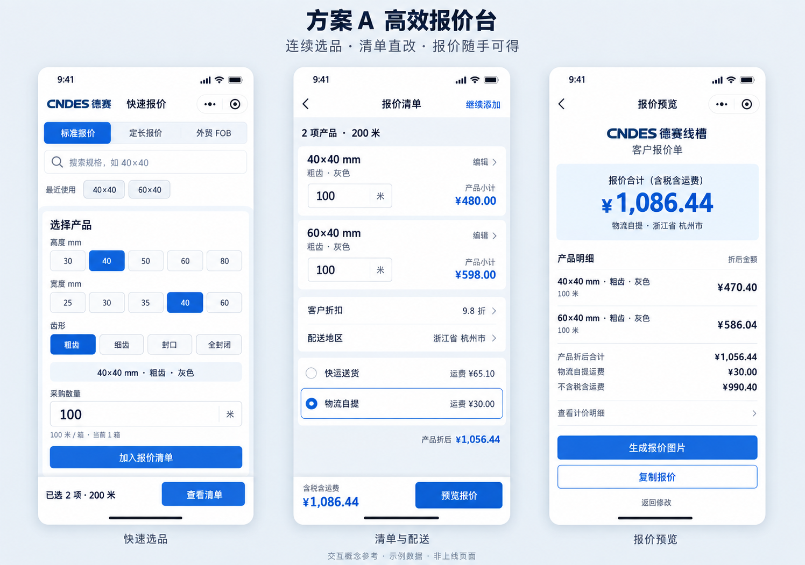
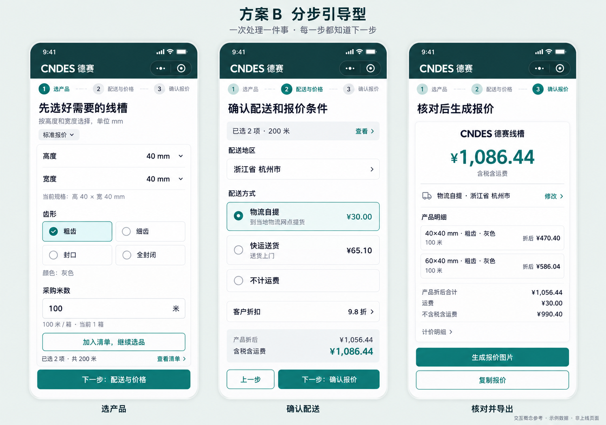

# CNDES 报价小程序：两套 UI 与交互优化方案

> 最新：用户已确定蓝色方案 A 主流程，吸收 B 的尺寸说明、配送解释和确认页层级，并明确要实施规格搜索。整合后的方案与新参考图见 [蓝色方案 A 优化版](blue-refined/README.md)。本文件保留早期比较依据。

日期：2026-09-12
阶段：方案比较与视觉参考，尚未实施到小程序。
核查依据：当前 WXML / WXSS / JS、现有项目设计文档、项目内历史报价图片。未连接微信开发者工具做真机操作，关于布局和流程的判断来自代码；历史图片不是当前运行截图。

## 结论与选择建议

优先建议方案 A「高效报价台」，前提是主要使用者为老板、业务员或熟悉规格的老客户：连续录入、快速改数量和反复调整报价是这类工具的核心价值。方案 B「分步引导型」更适合首次使用、使用频率较低、需要知道下一步做什么的人。

两套方案都保留 CNDES 品牌和标准、定长、FOB 三类报价。区别在于操作组织：A 围绕可反复编辑的报价清单，B 围绕三个明确步骤。用户后续已选定 A，正在进一步讨论规格搜索；本文件保留 B 用于记录比较依据，尚未开始修改小程序页面。

## 当前问题与优化依据

| 当前代码中的情况 | 对使用体验的影响 | 优化方向 |
|---|---|---|
| 报价页有品牌头、较大宣传区、模式栏和当前规格摘要，之后才是选品 | 首屏用于实际操作的空间减少 | 保留简短品牌栏；产品宣传主要放在申请页，报价页优先操作 |
| 规格齐全后 `quote-bento-active` 把规格和数量各放在半屏 | 手指点击区与输入区变窄，完成选择后布局也发生变化 | 整个选品表单始终单列；数量固定放在规格之后 |
| 「报价清单」与「报价结果」重复遍历同一个 `cart`，随后又进入独立结果页 | 页面变长，用户需要判断哪一处可以编辑 | 一个可编辑清单 + 一个客户预览，编辑页不再复制完整明细 |
| 有清单时切换模式会弹窗，确认后清空 | 临时切到 FOB 或定长会损失已录入的清单 | 建议新增三种模式的独立草稿；不把米、根、人民币、美元混为同一清单 |
| 配送选择、地址、两种运费结果分布于多块卡片 | 已选运输方式与多个总价之间的关系不突出 | 先地区，后配送方案；突出已选方案总价，对比结果次要显示 |
| 结果页手机表格有规格、单价、数量、重量、小计、折后等多列 | 长规格、颜色和较大金额容易挤占空间 | 手机端用两至三行的产品条目，详细计算展开查看 |
| 玻璃底、渐变、阴影和大圆角在多个层级重复 | 卡片装饰与报价数字争夺注意力 | 一个主要强调色、实体白底、轻边界和少量阴影 |
| 页面与输出使用「快递」「快运」等不同称呼 | 用户可能以为对应不同服务 | 面向用户统一名称为「快运送货」「物流自提」，实际服务范围沿用业务规则 |

主要源码：`pages/quote/quote.wxml`、`pages/quote/quote.wxss`、`pages/quote/quote.js`、`pages/quoteResult/quoteResult.wxml`。

## 方案 A：高效报价台

### 适合谁，解决什么

适合知道自己要什么规格、一次经常报多个规格的人。目标是缩短重复录入与修改路径，保留对当前清单、数量和金额的掌控。视觉接近清晰的商务工具：白底、蓝色操作、紧凑但不拥挤。

### 操作流程

进入上次报价模式 → 搜索或选择规格 → 选齿形、确认颜色 → 填数量 → 加入清单 → 连续添加 → 清单内调整折扣和配送 → 预览 → 复制或生成图片。

选品不强制逐页跳转；清单页与选品页可随时返回，已经填写的数据应保留。

### 1. 选品页：进来就能开始报价

- 顶部保留一行 CNDES 德赛和工具名称，三种报价模式使用分段切换，当前模式清晰可见。
- 新增规格搜索：支持输入 `40×40`、`40x40`、`4040`；命中后显示「高 40 × 宽 40 mm」。无分隔符输入仅在唯一匹配时直接定位；有歧义时让用户选匹配项，不擅自交换高宽。
- 可选新增「最近使用」，只从该使用者实际添加过的规格生成，首次进入没有记录时隐藏，不伪造热门规格。
- 保留高度 → 宽度 → 齿形的逐级约束；选项来自当前产品数据，有效项才能选择。布局始终为全宽单列，不在选完后变成两列。
- 全部高度允许换行或点击「全部高度」展开；图中只画常见可见部分，不代表删除其他尺寸。
- 只有一种颜色时直接显示「灰色」，无需再点一次。未来数据确有多色时才出现颜色选择。
- 数量框带固定单位。标准 / FOB 为米；定长为单根长度与根数。不要让用户仅凭数字猜单位。
- 「凑整箱」是可选快捷操作，旁边清楚显示改变后的米数；保留用户输入的非整箱数量，不自动改订单量。
- 点击加入后，显示明确反馈和更新后的清单数量。保留规格，清空本次数量，便于继续添加；相同产品、齿形、颜色及定长长度一致时按明确规则合并。
- 图中第一屏为清单已存在两项的状态，正在编辑的数量只有点击加入才进入清单。

### 2. 清单与配送：所有修改围绕同一份清单

- 每个产品以全宽条目展示：第一行规格与操作，第二行齿形、颜色，第三行数量与金额。编辑数量不需要删除再添加。
- 删除提供短暂「已删除 / 撤销」反馈；清空整个清单使用确认。删除按钮可点区域至少 44px，不做容易误触的小叉。
- 折扣、收货地区、配送方式集中在同一页。先确定地区再展示可用运价；未选地区明确显示「运费待计算」。
- 两种配送方式上下排列，分别说明「送货上门」「到网点自提」，价格就在选项旁边。只突出当前选中方案，不能用“最便宜”直接替代用户选择。
- 总价区域明确写「含税含运费」或「产品合计，未含运费」。不会把产品小计包装成已含运费的最终金额。
- 底部固定汇总与「预览报价」，即使清单很长也不需要滑到底。详细运价规则默认折叠。

### 3. 报价预览：一眼看懂金额和边界

- 第一眼显示本次报价合计及税费口径，第二眼是配送方式和地区，第三眼才是产品条目。
- 手机预览使用条目布局；导出的图片可以用更宽的正式报价排版，但规格、齿形、颜色不能用省略号藏掉。
- 「生成报价图片」作为主操作，「复制报价」作为次操作；成功生成图片后提供预览 / 保存。当前仅是设计建议，没有新增自动发送功能。
- 保留含税 / 不含税、原价 / 折后、重量件数与运输比较的核查能力，可放入「查看计价明细」。默认展示强调当前选中的口径。
- 国内客户导出中现有折扣等字段是否保留，实施时按已有业务要求处理；不能把手机页面折叠直接当作导出删除规则。

### 视觉规格

| 项目 | 建议 |
|---|---|
| 主色 | 商务蓝 `#1559C9` |
| 深色文字 | `#14263D` |
| 页面底色 | `#F4F6F9`，卡片白色 |
| 视觉特征 | 小品牌头、整齐条目、轻分隔、金额对齐、少量圆角 |
| 字号 | 正文 15–16px，辅助 12–13px，标题 20–24px，核心金额 30–34px |
| 触控 | 点击区域至少 44×44px，主按钮高 48–52px |
| 间距 | 页面边距 16px，区域间距 16–24px |

### 代价与边界

比单纯改颜色复杂，需要调整编辑页结构，增加搜索、清单状态和草稿保存；但选品、报价计算、结果数据可以继续复用。第一次使用的人仍需理解规格含义，必须保留尺寸顺序提示和按需帮助。

## 方案 B：分步引导型

### 适合谁，解决什么

适合第一次进入、不频繁报价、需要明确操作顺序的人。把一长页信息变为三个可回退、可修改的步骤。视觉采用深青品牌头、浅灰白内容和青绿操作色，字号与留白更舒展，强调“每次完成一件事”。这是备选品牌配色，还未替换现有蓝色。

### 操作流程

选择报价模式 → ① 选产品并完成清单 → ② 配送与价格 → ③ 确认报价 → 生成图片 / 复制。

步骤条体现当前阶段；返回上一步保留输入。允许跳回已完成步骤修改，不允许越过尚未满足的必填条件。这里的下一步是明确点击行为，不自动跳走。

### 1. 选产品：把尺寸说明放在操作旁边

- 第一次进入可先选择「标准 / 定长 / 外贸」，进入后收为紧凑模式栏，不另做充满宣传内容的首页。
- 标题是「先选好需要的线槽」，下方直接说明尺寸单位和顺序。高、宽各自一行选择，降低把 60×40 看反的可能。
- 规格选择仍依据当前有效数据；齿形可用两列按钮，但完整表单不压进半屏。
- 可设置「尺寸怎么看」「齿形有什么区别」按需帮助。使用审核过的真实产品图或尺寸图；参考图没有模拟产品结构，正式实施时不使用 AI 凭空生成齿形作为选型依据。
- 点击「加入清单，继续选品」可连续添加；清单已有内容时出现「下一步：配送与价格」。页面底部显示实际已选项数和总数量。
- 空清单时按钮禁用并显示「请先添加至少一项产品」，不能让用户进下一步后才遇到错误。

### 2. 配送与价格：上下文齐全才谈总价

- 标准模式依次显示地区、快运送货 / 物流自提 / 不计运费、折扣。
- 选择不同方式立即更新金额，并清楚说明提货方式，不能只用蓝绿颜色区分。
- 「不计运费」表示报价不包含运费，不等于包邮；预览与导出也使用同一说明。
- 定长模式仅保留当前支持的快运，不出现物流自提选项。
- FOB 模式把本步骤替换为「外贸参数」，使用汇率、折扣、FOB Ningbo 等现有参数，不出现国内省市与运输方式。
- 小幅汇总显示当前产品总价、运费及合计，让用户进入确认前已经知道价格变化。
- 参考图的折扣可修改入口按当前报价人员使用场景绘制。若实际主要面向客户自助，应另明确谁有权改折扣与汇率；仅把输入框隐藏不能代替权限控制。本次不新增角色体系。

### 3. 确认报价：按客户核对顺序排信息

- 上部显示金额、税费口径与配送，下面是产品明细。
- 产品和配送各有「修改」，点击回到对应步骤并保留其他数据，不从头再走一遍。
- 主操作是「生成报价图片」，次操作是「复制报价」；使用报价语言，不写支付、结算、下单成功等当前没有的业务功能。
- 单独客户图片仅渲染报价内容，页面上的步骤条、修改按钮和工具操作区不进入图片。

### 视觉规格

| 项目 | 建议 |
|---|---|
| 品牌头 | 深青 `#123A3A` |
| 操作色 | 青绿 `#087F73` |
| 内容背景 | 白色 + 很浅的中性灰 |
| 视觉特征 | 可读步骤条、大字段、舒适留白、明确的下一步 |
| 字号 | 正文 16px，标题 22–24px，合计 32–36px |
| 组件 | 字段 / 按钮高 48–56px，圆角 12–16px |
| 动效 | 150–220ms 过渡，只用于步骤、选择、反馈；无循环装饰动效 |

### 代价与边界

引导清晰，但熟练用户反复报价会增加步骤切换。需要维护步骤校验、回退保留、修改返回和不同报价模式的分支，开发与验收范围通常高于 A。不能仅凭图的留白多，就判断它一定更适合高频工作。

## 两套方案都应具备的交互细节

1. **键盘与底部按钮**：考虑微信原生输入键盘与底部安全区；聚焦字段必须可见。键盘收起后恢复汇总栏，按钮不覆盖最后一项。点击预览前要提交当前正在编辑的值，避免只依赖失焦更新造成旧金额。
2. **金额计算状态**：有效数字即时更新；无效 / 未完成输入不展示旧金额为新结果。字段下显示具体错误，保留原输入供修改；不要只弹一次稍纵即逝的 Toast。
3. **空 / 错误状态**：空清单给明确选品入口；规格无匹配可清空搜索；未配置的地区运费显示「暂无法自动计算」，不能显示 0 元使人误认为包邮。
4. **草稿保护（新增建议）**：按用户与报价模式分别保存。退出、返回不清空；切换模式恢复该模式草稿。恢复时用当前数据重新计算，价格表变化后提示“报价已重新计算”。草稿不等于已发送报价历史。
5. **清单变化**：添加、合并、编辑、删除都反馈实际变化；多规格较长时清单可滚动，但合计与下一步固定可见。
6. **报价边界**：标准与定长人民币报价、FOB 美元报价保持独立。FOB 客户文本和图片仍然是英文美元，不能包含人民币、折扣、汇率、内部港口分摊或国内运费。
7. **单位与格式**：高 × 宽 mm；标准数量 m / 米；定长长度 m/根、数量根；FOB 单价 USD/m。金额通常两位小数，FOB 米价沿用三位小数，不因排版先舍入再计算。
8. **真实业务数据**：颜色、齿形、装箱信息完全来自产品表。当前参考选择均为粗齿灰色；不把历史示意脚本里的白色、蓝色当成现有选项。

## 其他页面如何统一

- **申请页**：品牌与用途说明之后直接表单；公司、联系人、手机号、选填说明分清必填；提交中防止重复点击。隐私协议入口和同意流程继续保留。
- **审核中页**：明确“申请已提交，正在审核”，保留刷新与联系管理员。没有实际服务承诺，不写“几分钟内通过”。
- **管理员页**：优先展示待审核数量；公司名最高层级，联系人与时间次之，同意和拒绝分开。可新增待审核 / 已处理筛选，但不擅自改变审核权限或云函数。
- **结果图片**：CNDES 品牌头、明确总价、完整产品条目、计价口径和运输方式。长清单允许图片自然增长，不能缩小字号硬塞；所有价格与复制文本来自同一份计算结果。

## 实施范围与先后顺序

| 优先级 | 内容 | 性质 |
|---|---|---|
| P0 | 缩小品牌占屏、取消动态半屏表单、清理重复明细、统一单位文案、固定操作区 | 结构与视觉优化 |
| P0 | 选中配送对应的明确总价、未选地区与未配置运费的状态 | 交互与展示正确性 |
| P1 | 产品条目编辑、预览层级、生成图片与复制的主次操作、申请 / 审核页统一 | 完整体验改进 |
| P1 | 规格搜索、独立草稿、最近使用、删除撤销；或 B 的步骤与回退状态 | 明确新增交互功能 |
| P2 | 报价历史、客户管理、价格模板、自动识别清单 | 暂不纳入这次两套方案的必要范围 |

用户已选定 A 的主流程，下一阶段可做可点击原型和小程序页面实现；不要同时落地两个完整入口，增加后续维护成本。可以采用 A 的主要流程，加上 B 的字段说明与结果页层级。

正式实施时复用现有报价函数、产品表和运费表；现有国内、定长、FOB、客户输出隔离相关测试需通过。此轮只新增方案资料与更新项目偏好文档，不修改业务页面或数据文件。

## 验收任务与判断标准

建议用同一套任务比较当前版本与候选原型，分别让熟练用户和首次使用者完成：

1. 报两个规格，修改其中一个的数量，选择地区及配送，导出报价。
2. 添加五个规格后删除一个，再撤销。
3. 在三个报价模式间切换，再返回原模式检查草稿。
4. 定长输入 0.6 米 / 根及数量，并尝试无效长度，确认错误能就地修正。
5. FOB 修改有效汇率并生成英文报价，核对客户内容不出现内部参数。
6. 输入较大金额 / 长规格、选择无运价地区、生成图片失败后重试。

记录完成率、完成时间中位数、返回修改次数、错误数量和长距离滚动次数。设计目标是减少滚动与返工，不能在尚未实测时宣称提高了某个百分比。

覆盖 320 / 375 / 390 / 430px 等常见视口、键盘展开、底部安全区，以及字号放大的情况。最终应在微信开发者工具及真机核查，AI 参考图不构成这些交互测试的通过证据。

## 参考图示例数据与核验

两套图使用同一组假设采购数量，以当前源码计算，便于对比设计，不代表真实客户订单：

| 项目 | 数值 |
|---|---|
| 产品一 | 40×40 mm，粗齿，灰色，100 米；基础米价 ¥4.80 |
| 产品二 | 60×40 mm，粗齿，灰色，100 米；基础米价 ¥5.98 |
| 每箱米数 | 两项均为 100 米 |
| 国内折扣 | 9.8 折 |
| 地区 | 浙江省杭州市 |
| 原价合计 / 折后含税产品价 | ¥1,078.00 / ¥1,056.44 |
| 总重量 / 总件数 | 93 kg / 2 件 |
| 快运运费 / 含税总价 | ¥65.10 / ¥1,121.54 |
| 物流自提运费 / 含税总价 | ¥30.00 / ¥1,086.44 |
| 不含税产品价 / 加物流自提后 | ¥960.40 / ¥990.40 |

核验方式：用现有 `tests/helpers/loadMiniProgramPage.js` 加载实际报价页，基于当前 `data/products.js` 构造两行，调用现有 `recalc()`，核对以上汇总；未增加测试文件、未修改计算公式。这是现有代码在示例条件下的结果，不代表本次重新评审税务或运价政策。

## 文件与使用说明

- `scheme-a.png`：方案 A 参考图，三屏展示。
- `scheme-b.png`：方案 B 参考图，三屏展示。
- `image-prompts.md`：两张图片的完整生图提示词；使用内置 image_gen。
- 本文：业务流程、视觉规范、范围、边界与验收建议。

参考图由 AI 生成，用于比较方向；实现以本文的数据、规则和交互说明为准。参考图尚未转换成可点击原型或小程序页面。

## 后续细化：方案 A 的规格搜索

### 实现判断

基础规格搜索的开发难度较低：当前产品表只有 66 个高宽组合、11 种高度，而且已按高度、宽度、齿形、颜色等字段结构化。可以直接在小程序本地搜索，不需要新增搜索服务或调用 AI。完整体验的主要工作是候选列表、点击选中、键盘、无结果、旧输入清理以及与三种模式的状态衔接。

### 第一版建议行为

| 输入 | 结果 |
|---|---|
| 4040 / 40×40 / 40x40 / 40*40 / 40 40 | 优先显示 40×40，副文案明确「高 40 × 宽 40 mm」 |
| 6040 | 显示 60×40，不替换成 40×60 |
| 40 | 优先显示高度 40 的规格；宽度 40 的其他匹配放在后面，结果始终标清高宽 |
| 100100 | 匹配 100×100，不能假设高宽总是两位数字 |
| 未找到的完整规格 | 显示「当前规格表未找到，试试按高度和宽度选择」，保留清空搜索和手动选择入口 |

输入时更新候选列表，精确匹配排最前；用户点击结果才改变选品状态。无须另点搜索按钮，不能在用户尚未输入完时自行替换已选产品。候选列表首屏约 5–6 条，更多项在限定高度内滚动。

每条结果主要展示高宽和可用齿形；只有选择了齿形才能确定对应价格，第一版搜索结果不突出一个容易被误认为最终价的金额。点击 60×40 后加载其有效齿形、颜色、装箱数据，随后选择粗齿、填米数并加入清单。灰色为唯一可选颜色时自动选中。

### 接入现有结构

1. 新增查询文本与候选列表，在当前 `data/products.js` 建立高宽搜索键。
2. 规范乘号、x、星号、空格与全角数字；有明确分隔符的完整输入按高宽匹配，无分隔符的数字串与实际产品搜索键匹配。不要直接删除所有非数字再猜含义。
3. 将 `onHeightTap` / `onWidthTap` 中的选品更新整理为手动选择和搜索共同使用的逻辑，避免两份数据加载规则逐渐不一致。
4. 选择另一个规格时清理不兼容的齿形、旧规格价格和未提交数量，避免把前一个产品的输入带到新规格；已有清单不受搜索影响。
5. 三种报价模式共用尺寸搜索，但定长仍输入单根长度和根数，标准与 FOB 仍按米输入。

实时核查发现，当前 66 条记录的高宽拼接搜索键没有重复；未来如果出现重复，应显示多个候选，由用户选择，不自动取第一条。40×60 与 60×40 当前基础米价分别为 6.05 和 5.98，方向不同会影响报价，必须明确高宽。

### 分期与验证

- 首版：规格简写、常见分隔符、精确优先、部分输入候选、无结果、点击选中、保留手动入口。
- 后续可选：从实际使用记录生成最近规格，以及「6040 粗齿」等受控关键词查询。无需首版加入自然语言或整张清单识别。
- 验证：搜索选择与手动选择同一产品后数据及报价相同；高宽不倒置；不存在的组合不能选入；清空搜索不删除报价清单；返回与键盘行为正常；国内、定长、FOB 计算回归保持通过。

本节是功能说明与建议，未新增搜索实现代码。
