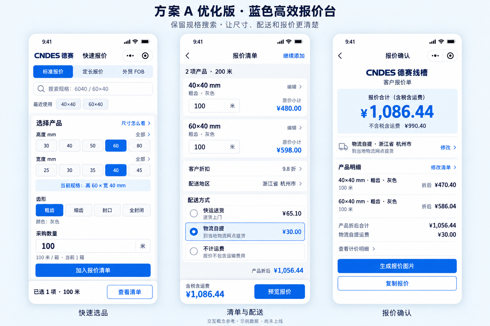
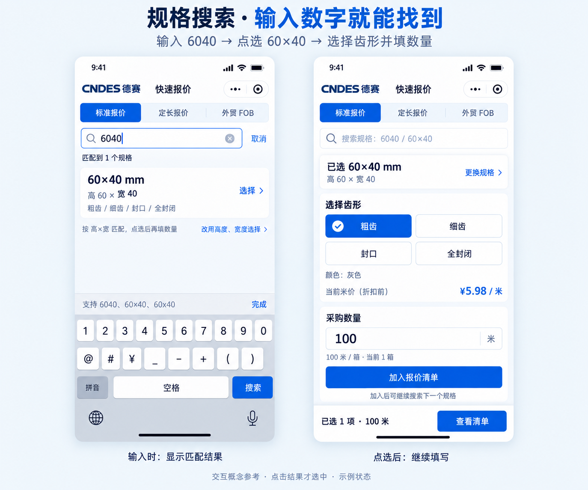

# 蓝色方案 A 优化版

日期：2026-09-12。状态：已确定设计方向，完成方案细化与两张参考图；小程序页面和搜索代码尚未实施。

## 用户已确定的方向

- 采用 A 的快速选品、连续添加、清单直改和固定操作区。
- 规格搜索是确定要做的功能，保持醒目入口。
- 吸收 B 的尺寸说明、配送解释和确认页信息层级。
- 全部使用蓝色商务视觉。
- 本轮按用户要求提供整合后的方案和参考图；原 A / B 图留存作对比。

## 主流程

快速选品 ⇄ 清单与配送 ⇄ 报价确认 → 生成图片 / 复制报价。

这三页是可直接返回修改的工具页面。沿用 A 的操作方式，不引入 B 的编号步骤条或强制逐步填写流程。用户可以连续添加多个规格，再统一调整配送与折扣。

### 快速选品

页面从上到下：小品牌栏 → 标准 / 定长 / FOB 模式 → 规格搜索 → 最近使用（有真实记录才显示）→ 当前选品 → 数量 → 加入清单。底部固定清单项数与「查看清单」。

规格搜索一直处于页面顶部。占位提示「搜索规格：6040 / 60×40」，让用户直接知道可以输入数字简写。查询时出现候选；点击候选才选中产品。

手动选品时，高度和宽度使用 A 的按钮结构，整个区域保持单列。每组提供「全部」入口，不能因为图里只画五个按钮就删除其余尺寸。选择完成后显示「当前规格：高 60 × 宽 40 mm」。

从搜索结果选中后，直接进入紧凑规格摘要「已选 60×40 mm / 高 60 × 宽 40」，旁边可点「更换规格」，无需再点一遍高度和宽度。手动入口仍可以展开。两种入口共用同一产品状态，不存在两套互不更新的选品数据。

尺寸帮助「尺寸怎么看」按需展开，简短说明规格顺序；若后续增加图示，使用审核过的产品尺寸图。本次图没有用虚构产品结构作选型依据。

齿形只显示当前规格的有效选项；只有一种颜色时直接显示灰色。选择齿形后可显示「当前米价（折扣前）」；搜索候选本身不突出未确定齿形的价格。

数量始终带单位：标准 / FOB 是米，定长为米/根及根数。装箱提示显示真实换算，用户可选择凑整箱，程序不自动修改米数。

### 清单与配送

顶部保留「继续添加」。每个产品用全宽条目显示规格、齿形、颜色、数量和金额；可编辑数量与条目，清单只出现一份。

清单条目若显示折扣前金额，明确标为「原价小计」；下面统一展示折扣与「产品折后」合计。避免条目和总价使用不同口径却没有标签。

配送按「地区 → 方式 → 合计」排列。快运、物流、不计运费上下展示，选中态用蓝色单选标记和浅蓝底。

| 选项 | 解释 | 总价说明 |
|---|---|---|
| 快运送货 | 送货上门 | 产品折后金额加快运运费 |
| 物流自提 | 到当地物流网点提货 | 产品折后金额加物流运费 |
| 不计运费 | 报价不包含运输费用 | 产品合计，明确标注未含运费 |

未选地区时显示「运费待计算」；该地区没有运价时显示「暂无法自动计算」，不能按 0 元显示成包邮。运输说明沿用实际业务范围，不新增送达时间承诺。

底部固定「含税含运费」与对应合计、「预览报价」。选择改变后同步更新金额。原价、折后、含税、不含税、运输总价必须分别标清，不能为了简洁混用。

### 报价确认

采用 B 的核对层级，保持 A 的蓝色视觉：

1. 品牌与客户报价单标题。
2. 当前报价合计，明确含税 / 运费口径；不含税金额作为次级信息。
3. 已选配送方式、地区、提货方式及「修改」。
4. 完整产品明细：规格、齿形、颜色、数量、折后金额；旁边「修改清单」。
5. 产品折后金额与运费构成；更详细的计价依据可展开。
6. 主按钮「生成报价图片」，次按钮「复制报价」。

修改配送回到配送区域，修改清单回到对应条目，并保留其他输入。导出的客户图片只包含报价内容；导航、修改按钮和工具操作区不进入图片。长规格、颜色不能省略成省略号。

## 搜索功能细节

左图是输入中的候选状态：输入 6040，只显示匹配结果，还没有切换产品；结果放在键盘上方可见位置。右图是点击候选后的选品状态：尺寸已确定，继续选择齿形和填写数量。

| 输入 | 行为 |
|---|---|
| 6040 / 60×40 / 60x40 / 60*40 / 60 40 | 匹配高 60、宽 40 |
| 40 | 高度 40 的规格优先，其他相关尺寸随后展示并标清高宽 |
| 100100 / 100120 | 按现有产品表的实际搜索键匹配，不固定按两位切分 |
| 无匹配 | 显示当前规格表未找到，保留手动选择入口 |

搜索使用本地产品数据。输入先规范常见格式，再用实际规格匹配；精确结果排在前面，有歧义时展示多个候选。60×40 与 40×60 不能互换。

点击候选后，加载同一套产品价格、齿形、颜色和装箱数据。不同规格切换时清理不兼容的齿形、旧价格和未提交数量，已加入的清单保持。清空搜索只清查询，不删清单。

搜索时主要展示候选列表，避免完整选品表单、键盘和固定按钮互相遮挡；退出搜索恢复正常表单。输入框支持数字简写，也兼容输入或粘贴带分隔符的规格，不能设置成排斥所有分隔符的输入。

图中右屏的 60×40 尚未点击加入，底部「已选 1 项 · 100 米」对应清单中已经存在的 40×40；加入当前项目后，清单变为 2 项、200 米。参考图用这个前后状态说明添加流程。

## 统一的蓝色视觉

| 元素 | 建议 |
|---|---|
| 主按钮、选中态、可点击文字 | 商务蓝 #1559C9 |
| 标题、正文 | 深蓝灰 #14263D |
| 页面背景 | 浅灰 #F4F6F9 |
| 内容区域 | 白色 |
| 强调区域 | 浅蓝 #EDF4FF |
| 间距与组件 | 页面边距约 16px，区域间隔 16–24px，圆角约 12px |
| 可读性 | 正文 15–16px，核心金额 30–34px，主要触控区至少 44px |

品牌头保持紧凑，装饰不挤占搜索与表单空间。蓝色用于操作、选中与关键金额，其他文字保持深色；不同时给每张卡片加重阴影或大面积渐变。

## 报价模式与实现边界

- 标准报价：按米，支持现有国内折扣、税价与配送。
- 定长报价：同一尺寸搜索，输入单根长度与根数；只显示现有支持的快运，不出现物流自提。
- FOB：同一尺寸搜索，显示外贸参数；客户输出继续是英文美元，不出现人民币、汇率、折扣、国内运费和内部港口分摊。
- 复用现有产品表、运费表与计算函数。新增搜索不能建立一份独立价格表。
- 三模式独立草稿、最近使用、删除撤销沿用 A 的后续建议；搜索已由用户明确要求做，其他建议不等同于已经实现。
- 原申请、审核及管理员能力保留，视觉后续统一到这套蓝色规范。

## 本轮交付与后续验证

本轮交付 `overview.png`、`search-detail.png`、本文和 `image-prompts.md`。使用内置 image_gen 生成，保留原方案 A / B 文件。参考图用于查看方向，不是当前运行截图或可点击原型。

已查看两张生成图，核对了蓝色方向、搜索入口、高宽顺序、选中配送、报价合计及条目金额。搜索图中的键盘为状态示意，实施时使用系统实际键盘并做遮挡检查。

示例数据沿用已核对的同一组：40×40、60×40 粗齿灰色各 100 米，国内 9.8 折、浙江。原价 ¥1,078.00；折后含税产品价 ¥1,056.44；快运 ¥65.10；物流自提 ¥30.00；选择自提时含税含运费 ¥1,086.44，不含税含运费 ¥990.40。不是实际客户订单。

实现时检查：搜索与手选同规格结果一致、尺寸不倒置、清单数量编辑、配送切换及无运价状态、返回修改保留、键盘遮挡，以及国内 / 定长 / FOB 的计算与客户输出回归。效果提升需原型与真机比较，不能把参考图视为测试通过。
